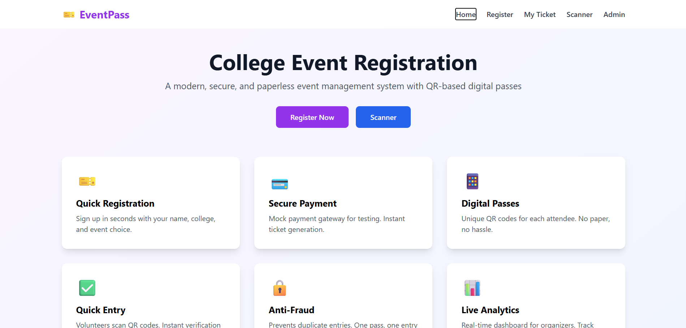
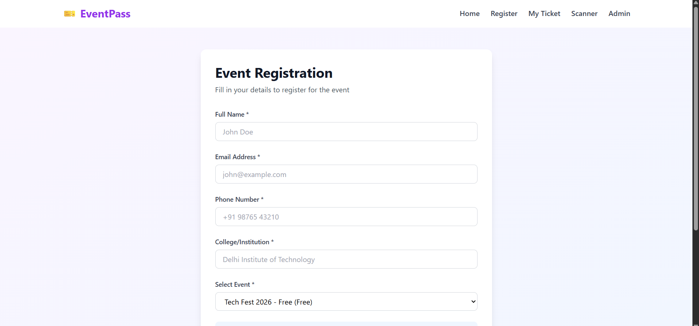
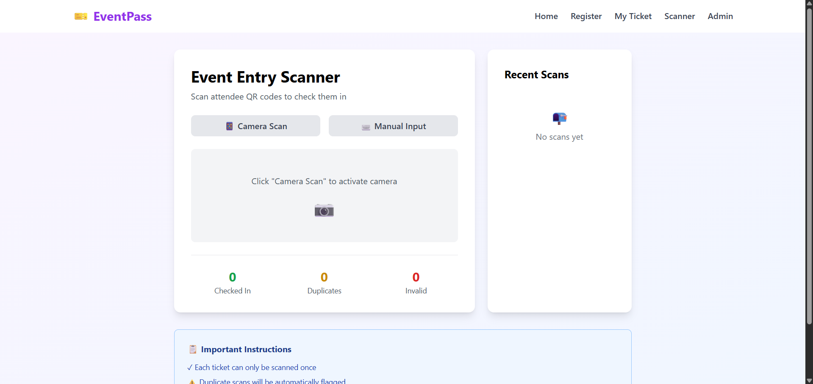
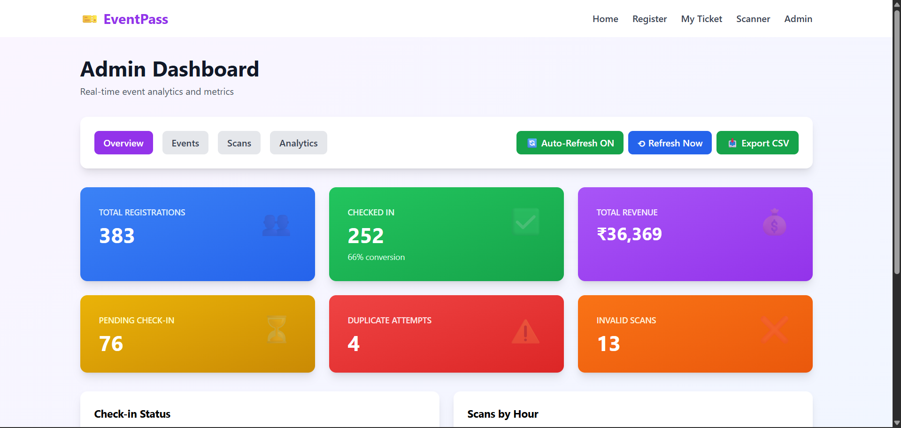

# College Event Registration Pass Generator

A full-stack web application for managing college event registrations and generating QR code passes for attendees. This system simplifies event access management by automating pass generation and distribution.

## 🎯 Features

- **Event Registration Management**: Register attendees for college events  
- **QR Code Generation**: Automatically generate unique QR codes for each registered participant  
- **Email Distribution**: Send registration passes via email (with QR codes attached)  
- **Secure Access**: Built-in security configuration and CORS support  
- **Modern UI**: Responsive React frontend with Tailwind CSS styling  
- **RESTful API**: Well-structured REST API for seamless frontend-backend integration  

---

## 📸 Screenshots

### 🏠 Home Page
<p align="center">
  
</p>

### 📝 Registration Page
<p align="center">
  
</p>

### 💳 Scanner Page
<p align="center">
  
</p>

### 🎟️ Admin Dashboard
<p align="center">
  
</p>

---

## 🛠️ Tech Stack

### Backend
- **Framework**: Spring Boot 4.0.6  
- **Language**: Java 17  
- **Build Tool**: Maven  
- **Key Dependencies**:
  - Spring Web  
  - Spring Security  
  - ZXing (QR Code Generation)  
  - Lombok (Boilerplate reduction)  

### Frontend
- **Framework**: React 19  
- **Build Tool**: Vite  
- **Styling**: Tailwind CSS  
- **Linting**: ESLint  
- **Node.js**: Recommended v18+  

---

## 📋 Prerequisites

- Java 17 or later  
- Maven 3.6+  
- Node.js 18+ and npm  
- Git  

---

## 🚀 Installation & Setup

### 1. Clone the Repository

```bash
git clone https://github.com/yourusername/College_Event_Registration-Pass_Generator.git
cd College_Event_Registration-Pass_Generator
